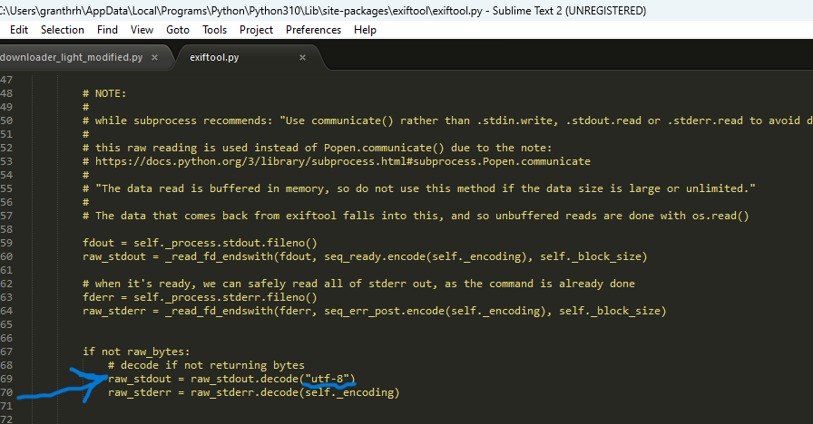

# Downloader
## About the tool


## Installation

The tools for downloading and checking files.
1. Download [exiftools](https://exiftool.org/install.html)
2. Add to path in environmental variables. (sysdm.cpl -->advanced-->environmental variables--> path)
3. Install PyExifTools.
   ```
   pip install pyexiftool

   ```
4. Add your link to download and folder where to download and run as on the example:
   ```
def main():
    # Example URL of a file to download
    url = "https://example.com/image.jpg"  # Replace with the actual URL of the file
    save_directory = r"C:\Users\YourUsername\Downloads"
    if not os.path.exists(save_directory):
        os.makedirs(save_directory)
    
    # Step 1: Download the file
    downloaded_file = download_file(url, save_directory)
    # Step 2: Extrac metadata with Exiftool
    if downloaded_file:
        extract_metadata(downloaded_file)

if __name__ == "__main__":
    main()
   ```

## Encoding problem
   
If you get an error related with encoding you can open exiftool.py file from python/site-packages/exiftool folder and change the following line:


 
